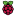

[](https://github.com/winder/Universal-G-Code-Sender/commits/master)
[](https://app.travis-ci.com/github/winder/Universal-G-Code-Sender)
[](https://codebeat.co/projects/github-com-winder-universal-g-code-sender-master)
[](https://github.com/winder/Universal-G-Code-Sender/releases)

Universal G-Code Sender is a Java based, cross platform G-Code sender, compatible with [GRBL](https://github.com/gnea/grbl/), [TinyG](https://github.com/synthetos/TinyG), [g2core](https://github.com/synthetos/g2) and [Smoothieware](http://smoothieware.org/).

Online documentation and releases: http://winder.github.io/ugs_website/<br/>
Discussion forum: https://groups.google.com/forum/#!forum/universal-gcode-sender

Technical details:

* [JSSC](https://github.com/scream3r/java-simple-serial-connector) or [JSerialComm](https://github.com/Fazecast/jSerialComm) for serial communication
* [JogAmp](https://jogamp.org/) for OpenGL
* Built with [Netbeans Platform](https://netbeans.org/features/platform/)
* Developed with NetBeans 8.0.2 or later

## Downloads
Below you will find the latest release of UGS.<br/> For older releases please visit the [releases page](https://github.com/winder/Universal-G-Code-Sender/releases).

**UGS Platform**<br>
The next generation, feature packed variant based on the Netbeans Platform.<br>
Unpack and start the program ```bin/ugsplatform```

| Latest release (v2.0.9) | Previous release (v2.0.8) | Nightly build  |
|:------------------------|:---------------|:--------------|
| [ Windows](https://ugs.jfrog.io/ugs/UGS/v2.0.9/ugs-platform-app-win.zip)           | [ Windows](https://ugs.jfrog.io/ugs/UGS/v2.0.8/ugs-platform-app-win.zip)           | [ Windows](https://ugs.jfrog.io/ugs/UGS/nightly/ugs-platform-app-win.zip)  |
| [ Mac OSX](https://ugs.jfrog.io/ugs/UGS/v2.0.9/ugs-platform-app-ios.dmg)               | [ Mac OSX](https://ugs.jfrog.io/ugs/UGS/v2.0.8/ugs-platform-app-ios.dmg)               | [ Mac OSX](https://ugs.jfrog.io/ugs/UGS/nightly/ugs-platform-app-ios.dmg) |
| [ Linux](https://ugs.jfrog.io/ugs/UGS/v2.0.9/ugs-platform-app-linux.tar.gz)        | [ Linux](https://ugs.jfrog.io/ugs/UGS/v2.0.8/ugs-platform-app-linux.tar.gz)        | [ Linux](https://ugs.jfrog.io/ugs/UGS/nightly/ugs-platform-app-linux.tar.gz) |
| [ RaspberryPI](https://ugs.jfrog.io/ugs/UGS/v2.0.9/ugs-platform-app-pi.tar.gz) | [ RaspberryPI](https://ugs.jfrog.io/ugs/UGS/v2.0.8/ugs-platform-app-pi.tar.gz) | [ RaspberryPI](https://ugs.jfrog.io/ugs/UGS/nightly/ugs-platform-app-pi.tar.gz) |
| [ All platforms](https://ugs.jfrog.io/ugs/UGS/v2.0.9/ugs-platform-app.zip)                    | [ All platforms](https://ugs.jfrog.io/ugs/UGS/v2.0.8/ugs-platform-app.zip)                    | [ All platforms](https://ugs.jfrog.io/ugs/UGS/nightly/ugs-platform-app.zip) |

**UGS Classic**<br>
A clean and lightweight variant of UGS (requires [Java](https://java.com/en/download/manual.jsp)). <br>
Unpack and start the program by double clicking the jar file. On some platforms you may need to run the included start script. <br>

| Latest release (v2.0.9) | Previous release (v2.0.8) | Nightly build  |
|:---------------|:---------------|:--------------|
| [ All platforms](https://ugs.jfrog.io/ugs/UGS/v2.0.9/UniversalGcodeSender.zip) | [ All platforms](https://ugs.jfrog.io/ugs/UGS/v2.0.8/UniversalGcodeSender.zip) | [ All platforms](http://bit.ly/2HhJIir) |


## Screenshots

### UGS Platform

UGS Platform main window


Customizable panel layout


Menu actions with customizable keybindings


Menu with plugins


One of many plugins


Basic gcode editor


### UGS Classic

UGS Classic main window


UGS Classic with visualizer


## Development

For development the [Maven](http://maven.apache.org) build tool is used.

#### Start the application

UGS Classic: 
```bash
mvn install
mvn exec:java -Dexec.mainClass="com.willwinder.universalgcodesender.MainWindow" -pl ugs-core
```

UGS Platform: 
```bash
mvn install
mvn nbm:run-platform -pl ugs-platform/application
```


#### Execute all tests

```bash
mvn test
```


#### Building the self-executing JAR

```bash
mvn install
mvn package -pl ugs-core
```


#### Build a UniversalGcodeSender.zip release file

```bash
mvn package assembly:assembly
```

#### Develop via IntelliJ

If you are more used to IntelliJ, you can also build, run and debug it there.

- Run  `mvn nbm:run-platform -pl ugs-platform/application` once via terminal to build everything
- Import the Source, `File` -> `New` -> `Project from existing Sources`
- Setup a new "Run Configuration", `Java Application`, with following settings:
  - Main Class: `org.netbeans.Main`
  - VM Options: `-Dnetbeans.user=$ProjectFileDir$/ugs-platform/application/target/userdir -Dnetbeans.home=$ProjectFileDir$/ugs-platform/application/target/ugsplatform/platform -Dnetbeans.logger.console=true -Dnetbeans.indexing.noFileRefresh=true -Dnetbeans.dirs="$ProjectFileDir$/ugs-platform/application/target/ugsplatform/ugsplatform:$ProjectFileDir$/ugs-platform/application/target/ugsplatform/platform:$ProjectFileDir$/ugs-platform/application/target/ugsplatform/ide:$ProjectFileDir$/ugs-platform/application/target/ugsplatform/extra:$ProjectFileDir$/ugs-platform/application/target/ugsplatform/java"`
  - Program arguments: `--branding ugsplatform`
  - Working dir: `$ProjectFileDir$`
  - Use classpath of module: `ugs-platform-app` 
- There is a [runConfiguration](.idea/runConfigurations/UGS_Platform.xml) in the repository, which should be available after importing the project
